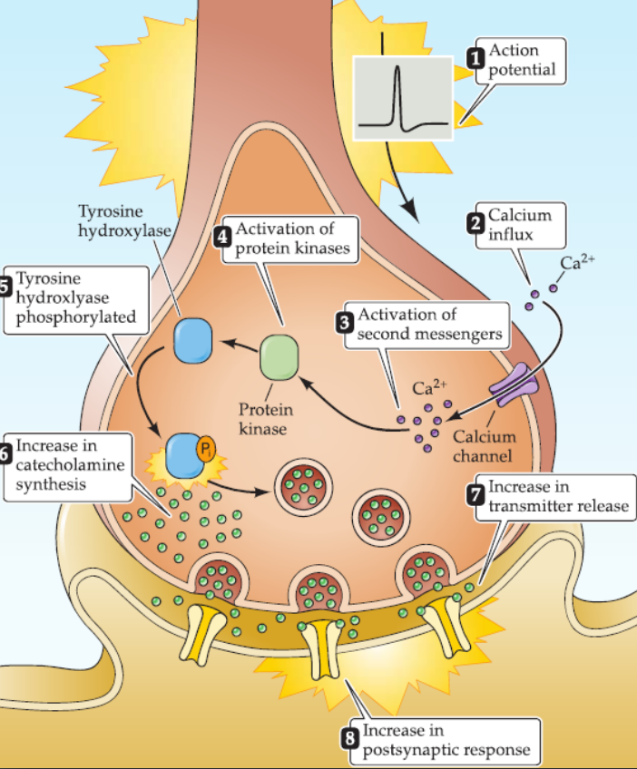

# 7. Molecular singaling within neurons

## Chemical signaling
Chemical communication coordinates the behavior of individual nerve and glial
cells in physiological processes that range from neural differentiation to
learning and memory. To carry out such communication, a series of
extraordinarily diverse and complex chemical signaling pathways has evolved.
The essential componets of chemical signaling contains: signaling cell, signal,
receptor, target molecule and response. Here are 3 major forms of chemical
signaling: synaptic transmission, paracrine signling(旁分泌) and 
endocrine(内分泌) signaling.

### Cell impermeant: have transmembrane receptor
short-lived, rapidly 

### Cell-permeant molecues
insoluble in aqueous

### Cell-associated molecules
adhesion mlecues, physical conact be

## Receptor types
Binding of singal molecules causes a conformational chagne in the recdptor, which
then triggers the subsequent signaling cascade within the affected cell. The 
receptors for impermeant signal molecules are membrane-spanning proteins, while
intracelluar receptors are activated by cell-permeant or lipophilic singaling
molecules. Channel-linked receptors have the receptor and transduing functions
as part of the same protein molecule. And the intracellular domain of enzyme-linked
receptors is an enzyme whose catalytic activity is regulated by the binding of
an extracellular signal.

Enzyeme-liked receptors: protein kinasee

GPCR
small G protein
directly bind to and activate inon channels, In summary, the binding of chemical
signals to their recetpor activate, the diversity of G-protein and 
their downsteram, influence the membrane poteial

### Second messengers
Ca2+, Cyclie AMP, th calcium ion ,胞内低，

calmdodulin,

10e-9 --> 10e-3
calcium pump, Na/ca exchanger, into er and mit\
IP3 receptor, 

(key point: how the neurnransmitter package)

cAMP
c7

PKA
CaMKII

pAKC

Protein tyrosine kinases

MAPK

phosphatas

 
Nuclear signaling
promoting the synthesis of new RNA and protin.
CREB, concergence of mutiple signaling pathways onto a single transcription

Nuclear receptor

c-fos
rest: very low

Example:
NGF1
