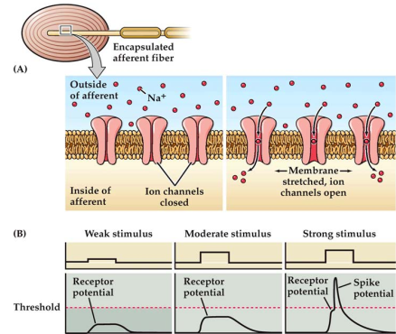
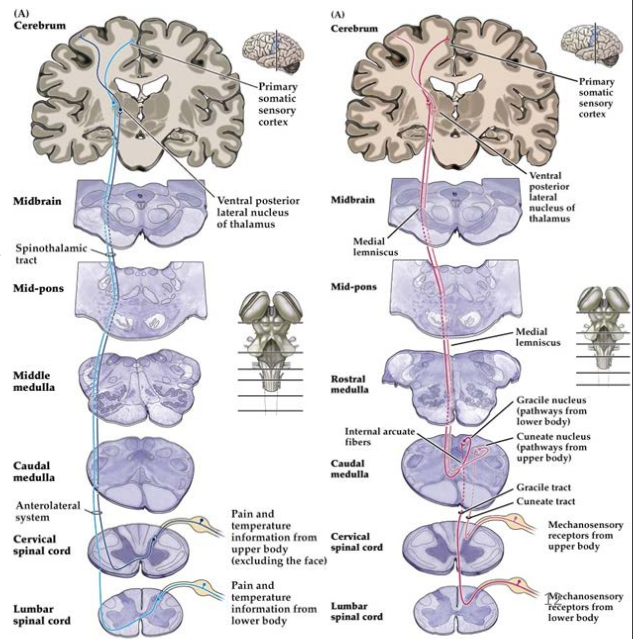
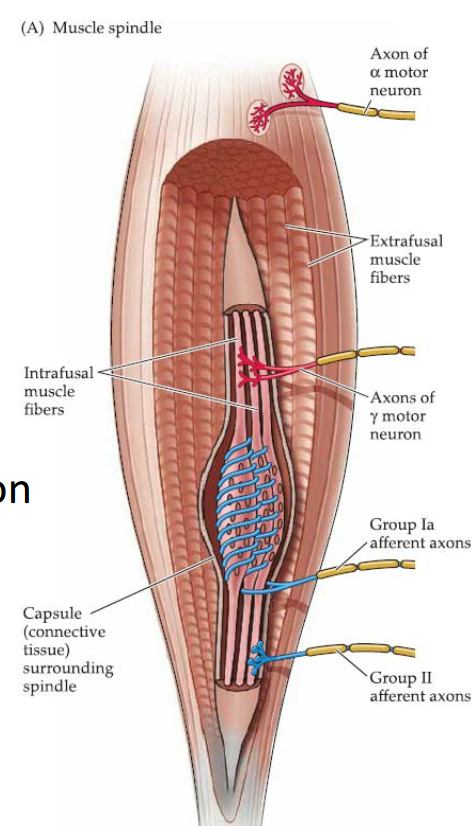

# 9. Somatic sensory system: Touch and Proprioception

The somatic sensory system(体感？) can be divided into fucntionally distinct 
subsystems with
distinct sets of peripheral receptors and central pathways. One subsystem
transmits information form cutaneous(皮肤) mechanoreptors ans mediates the 
senations of fine touch, vibration, and pressure. Another originates in
specialized receptors that are asociated with muscles, tendous, and joints ans
responsible for proprioception(本体感受)---our ability to sense the position of
our own limbs and other body parts in space. A third subsystem arises from
receptors that supply information about painful stimuli and changes in
temperature as well as coarse touch. 

## From the skin surface to central circuits
In general, the afferent fibers(传入) convey somatic sensory information 
to the central nervous
system. Firstly, the somatic sensation originates from the skin or muscle. A
stimulus alters the permeability of cation channels in the afferent nerve
endings, generating a depolaring current konwn as receptor potential.
Action potentials generated in afferent fibers by events that occur in the skin
or in muscle propagate along the fiber and past the location of the cell body
in the ganglia. 

> Sensory afferents are further differentiated by the temporal dynamics of
their response to sensor stimulation. Some afferents fire rapidly when a
stimulus is first presented, then fall silent in the presence of continued
stimulation; others generate a sustsained discharge int he presence of an 
ongoing stimulus. Rapidly adapting afferents(those that become quiescent
in the face of continued stimulation) are thought to be particularly
effective in ocnveying information about changes in ongoing stimulation
such as those produced by stimulus movement. In contrast, **slowly adapting
afferents** are better suited to provide information about the spatial
attributes of the stimulus, such as size and shape.

## Mechanoreceptors Specialized for Proprioception
While cutaneous mechanoreceptors provide information derived from extrenal
stimuli, another major class of receptors provides information about
mechanical forces arising within the body itself particularly from the
musculoskeletal system. The purpose of these proprioception("receptors for self")
is primarily to give detailed and continuous information about the position of
the limbs and other body parts in space.

## Summary
The acitivity is conveyed centrally via a chain of nerve cells, referred to as
the first-, second-, and third-order neurons.

- First-order neurons are located in the dorsal(背) root and cranial(脑) nerve ganglia.
- Second-order neurons are loacted in brainstem nuclei.
- Third-order neurons are found in the thalamus(丘脑), from whence(根源) they 
project to the cerebral cortex.

