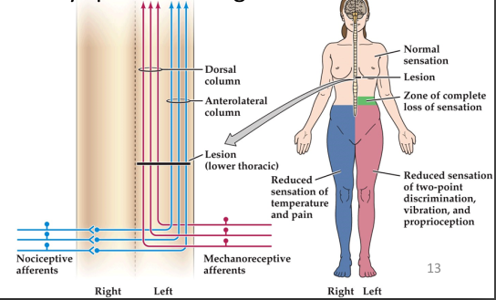

# 10. Pain

The perception of injurous stimuli, called nociception, depends on sepcifically
dedicated receptors and pathways. The relatively unspecialized nerve cell
endings that initiate the sensation of pain are called **nociceptors**.
		
## Nociceptors
The subserve somatic sensation are not involed in the transmission of pain.

The receptor that confers this sensitivity to heat also confers sensitivity
to capsaicin, the ingredient in chili pepers respinsible for the tingling
or burning sensation produced by spicy foods.

Most of the slower-conducting, unmyelinated C fiber nociceptors respond to
all forms of nociceptive stimuli-thermal, mechanical, and chemical--and are
therefore said to be polymodal.
辣的定义：稀释多少倍后，尝不到辣味。

Nociceptive receptors: Structurally, **Transient receptor potential(TRP)** 
channels resemble voltage-gated potassium  or cycli nucleotide-gated channels, 
having 6 transmembrane domain with a pore between dominas 5 and 6. Under 
resting conditions, the pore of channel is closed. In the open, activated 
state, these receptors allow an influx of sodium and calcium that initiates 
the generation of action potentials in the nociceptive fibers.

## Central pain pathways

Dorsal column-media lemniscal system
为什么是同侧受损?

## Sensitization

central sensitization,
neuropathic pain(神经病理)

## The Placebo Effect

The word *placebo* means " I will please,",  and the **placebo effect** is defined as a physiological response following the administration of a pharmacologically inert "remedy".

