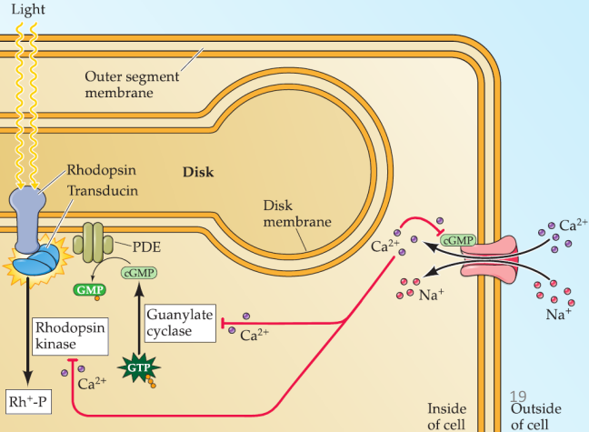

# 11.Vision --- The Eye

The human visual system is extraordinary in the quantity and quality of 
information it supplies about the world. Equally remarkable is the fact that
viewers can discren visual information over a wide range of stimulus 
intensities, from th faint light of start at ngiht to bright sunlight.

The next two chapters describe the molecular, cellular, and higher order
mechanisms that allows us to see. The first setps in the process of seeing
involve transmission and refraction of light by the opics of the eyes, the
transduction of light energy into electrical signals by photoreceptors, and
the refinement of these signals by synpaitic interaction with the neural
circuits of the retina.

The anatomy of human eye are show in figure.

## Retina
In fact, retinal, is neural portion of the eye, is part of the central 
nervous system. The development of eye is interesting and confused as
in following figure.

Here are 5 class neurons in retain: **photoreceptors, bipolar cells,
ganglion cells, horizontal cell and amacrine**. Photoreceptors contain
cone and rod, which contain photopigment in the outer segment. Light can
initiates a cascade of events that changes the membrane potential of the
receptor.

Horizontal cells are thought to maintain the visual system's sensivity to
contrast, over awide range of light intensities, luminance. Different
subclasses of amacrine cells are thought to retinal ganglion cells.

Based on neurons type, retinal divide to three layer: ganglion cell layer,
inner nuclear layer, outer nuclear layer. Interesting, almost synapses located
in edge between layer.

Retinal pigment epithelium plays two roles that are critical to the function
of retinal photoreceptors.

+ During light-sensitive photopigment life span, disks move progressively from
the base of the outer segment to the tip.
+ Regenerate photopigment after they have been exposed to light.

## Phototransduction
In the retina, however, photoreceptors do not exhibit action potentials; rather,
light activation causes a graded change in membrane potential and a corresponding
change in the rate of transmitter release onto postsynaptic neurons. More
surprising is that shining light on a photoreceptor, either a rod or a cone,
leads to membrane _hyperpolarization_ rather than depolarization as following
figure. In the dark, when photoreceptors are relatively depolarized, the # of
open $Ca^{2+}$ channels in the synaptic terminal is high, and the rate of
transmitter release is correspondingly great. In the light, when receptors are
hyperpolarized, the # of open $Ca^{2+}$ channels is reduced, and the rate of
transmitter release is also reduced.

The photopigment contains the light-absorbing chromophore **retinal**(an aldehyde
of vitamin A) coupled to one of several possible(???) proteins called **opsins**.
Light sensitivity of photoreceptors are maintained by the retinoid cycle.

One of the important feature of this complex biochemical cascade initiated by
photon capture is that it provides **enormous signal amplification**. Single
photon results in the closure of approximately 200 ion channels, or 2% of the
number of channels in each rod that are open in the dark. Finaly, it causes a
net change in membrane potential of about 1mV.

The concentration of $Ca^{2+}$ in the outer segment appear(???) to play a key
role in **Light adaptation**. Light-induced closure of these cGMP-gated channels
leads to a net decrease in the internal $Ca^{2+}$ concentration. This decrease
triggers a number of changes in the phototransduction cascade, all of which tend
to reduce the sensitivity of the receptor to light.

## Functinoal Specialization of the Rod and Cone Systems
The rod system has very low spatical resolution but is extremely sensitive to
light; it is therefore specializaed for sensitivity at the expense of resolution.
Conversely, the cone system has very high spatial resolution bu is relatively
insensitive to light; it is specialized for acuity at the expense of sensitivity.

Rod and cone's differences transduction mechanisms determined the ability of rods
and cones to respond to different ranges of light intensity. Then the arrangement
of the circutis that transmi rod and cone information to reinal ganglion cells
also conributes to the different characteristics fo scoptopic and photoic vision.
Another dramtic different between rod and cone circuitry is their degree of
convergence.Each rod bipolar cel is contacted bya number of rods, and many rod
biopolar cells contact a given amacrine cell. Thus, each of the retinal ganglion
cells do not.

在黑暗的时候，看到的东西都是黑白的。夜盲: lost the function of rod

## The distribution of Rods and Cones

Rod: 90 million
Cone: 4.5 million
The central 30 micron focus area is rod-free.

## Cones and Color Vision
Cones have three type of photogiment than rod.

AndJeremy Nathans and his colleagues at JHU identify and sequence the genes that
encode the three human cone pigments, which show a high degree of sequence
homology and lie adjacent to each other on the X chromosome.

