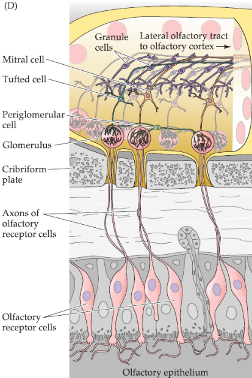

# 15. The Chemical Senses
Three sensory systems are associated with the nose and mouth: the olfactory(smell),
gustatory(taste),and trigeminal(chemosensory irritant) systems. Each of these
is dedicated to the detection of cehmicals in the environment. From an evolutionary
perspective, the chemical senses --- particularly olfaction --- are deemed to be
the "oldest" or "most primitive", yes they remain in many ways the least understood
of the sensory modalities.

## The Organization of the Olfactory System

**Odorants** interact with olfactory receptor neurons found in **olfactory epithelium**,
that lines the interior of the nose. Axons arising from receptor cells project
direcetly to neurons in the **olfactory bulb**.

## Olfactory Epithelium and Olfactory Receptor Neurons

The transduction of olfactory information --- a series of neural events that
ultimately results in the conscious sense of smell.

Odorants presented to the cilia(9+2 arrangement of microtubules) of an isolated 
olfactory receptor neuron elicit a robust electrical response. But those presented
to the cell body do not.

## Physiological Mechanisms of Odor Transduction
Once an odorant is bound to an odor recpotor protein, several additional steps
are required to generate a receptor potentital that converts chemical information
into electrical signals that can be interpreted by the brain. In mammals, the
principal pathway for generating electrical ativity in olfactory receptors
involves cyclic nucleotide-gated ion channels.
G-PCR family

## The Olfactory Bulb
It is not clear how odor identity and concentration is mapped across the entire
array, or reflects the activation of smaller subsets of glomeruli. In mice,
natural odorants presented at therier normal concentrations activate a relatively
small subset of glomeruli, each of which respinds selectively to one or two molecules
that characterize teh complex odor.

## Cotical processing of lofactory information
The details of central olfactory processing are unclear.
减少信号损失，解码器？
