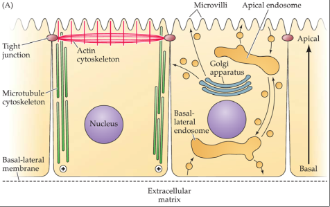
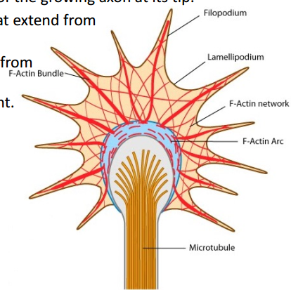
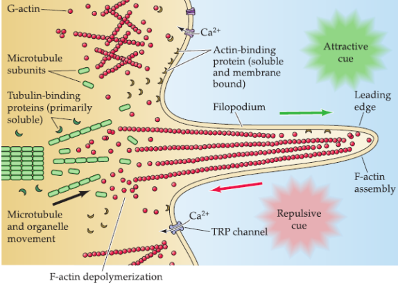

# Part 2, Nervous System Development and Diseases(Ch23)

## 2.2. Construction of Neural Circuits

### Neuronal Polarization: The first step in Neural Circuit Formation
Neurons are especially examples of **polarized epithelial cells**, a fundamental
cell found in most tissues. Polarized epithelial cells consists apical domain
and basolateral domain. **Apical domain** has a distinctive cytoskelton, and membrane
extensions(villi) that increase the surface area for taking in and releasing
specific molecules, where are tight junctions and Golgi apparatus is oriented
toward the apical membrane. Apical domain will develop to axon. The **basolateral domain**
makes contact with the extracelluar martix, the plus ends of microtubles are
oriented toward basolateral domain. Basal domain will develop to denrites.

Neurites ---Microtuble and actin redistributed---> form axon ---> form dendrites.
**PAR proteins** family regulate cell polarity.

### The Axon Growth Cone
Once the **axon** has been specified, it navigates over millimeters or even
centimeters, throught complex embryonic terrain, to find appropriate synaptic
partners. **Axon growth cone** is a specifilized structure at tip of extending
axon.

The cone is drived by the polymerization and depolymerization of actin and
microtuble cytoskeletons with the energy from ATP. Actin cytoskelton regulates
the change of filopodium and lamellipodium to discovery environment. Microtuble
enlongate the axon.

### The Molecular Basis of Growth Cone Motility
polymerization and depolymerization

The dynamic

Mechanisms regulating polymerization

### Non-diffusible Signals for Axon Guidance

#### extracelluar matrix cell adhesion moleculesa
+ the first to be associated with axon growth
+ lamins, dcollagesn, and fibronctin
	+ secreted by cell itself or
+ cell surface receptors: intergins
+ CAMs and caderins fasciculation(形成束状)

+ ephrins  (-rins alway about ligand)

### Chemoattraction and chemorepulsion

+ small amounts of factor
+ distinguishing tropic molecules and trophic
+ solved by laborios biochemical purfied

both chemoattraction and chemorepulsion are need, or the axon will stop
growth.

### The Formation of Topographic Maps 
 Netrins ("to guide") & Slits (repulsion)
+ C. elegans:
	+
+ DCC

most passway will change the cytoskeletal

semaphorin

### Selctive synapse formation

Nrg1

Trophic
+
+ In the absence of synaptic partneer

## Neurotrophic factor: signaling moleculs provided by target

target-derived trophic support regulates survival of related

### Competitive Interactions and the Formation of Neuronal Connection
polyneuronal innervation
synapse elimination
Convergence
Divergence: the number of connections

Neurotrophic prtein: NGF as a model system

Nurotrophic signaling:
	+ neural process growth/retraction
	+ NGF acts locally to stimulate neurite growth

Neurontrophin receptors and their specificity
